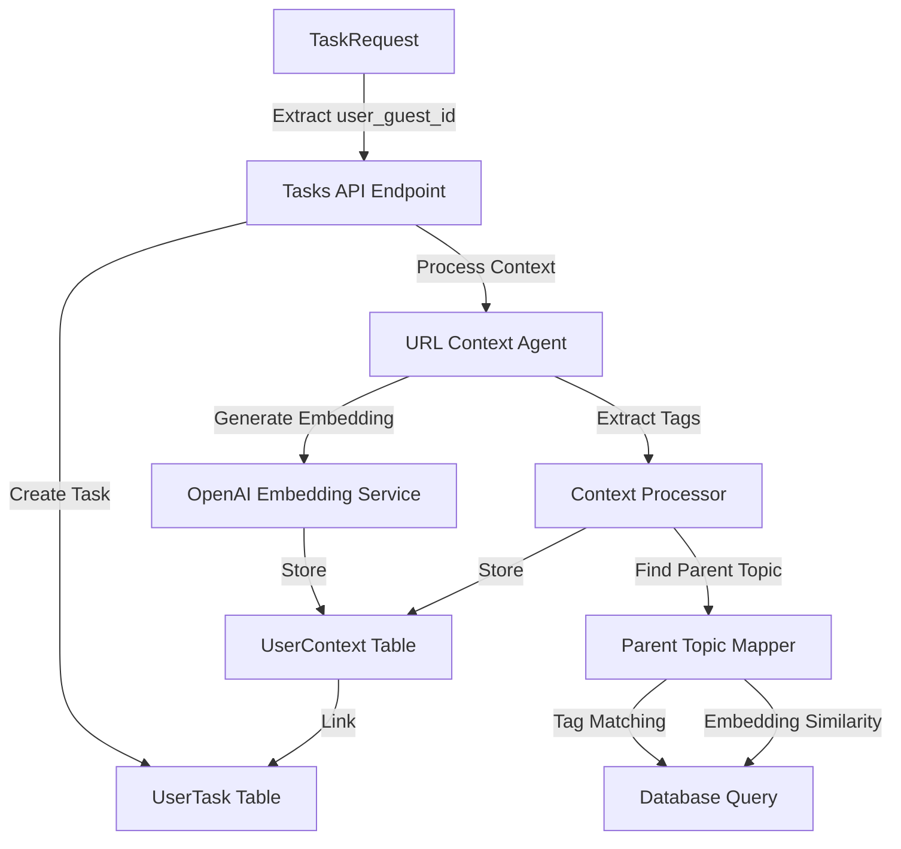

# Database Integration for Tasks API

## Overview

This plan integrates PostgreSQL with pgvector to store user contexts and tasks. The implementation includes database models, migrations, embedding generation, and API updates to persist all relevant data.

## Architecture

## Implementation Steps

### 1. Dependencies and Configuration

**Files to modify:**

- `pyproject.toml` - Add database dependencies

**Dependencies to add:**

- `sqlalchemy>=2.0.0` - ORM
- `alembic>=1.13.0` - Database migrations
- `asyncpg>=0.29.0` - Async PostgreSQL driver
- `pgvector>=0.3.0` - pgvector support for SQLAlchemy
- `openai>=1.0.0` - OpenAI API for embeddings
- `python-dotenv>=1.0.0` - Environment variable management

**New files:**

- `app/core/config.py` - Configuration management with environment variables
- `.env.example` - Example environment variables file

### 2. Database Models

**New files:**

- `app/models/__init__.py` - Models package
- `app/models/user_context.py` - UserContext model
- `app/models/user_task.py` - UserTask model

**Key model fields:**

- `UserContext`: context_id (UUID primary key), context_tags (ARRAY), raw_content (TEXT), user_defined_context (TEXT), embedding (VECTOR), url (TEXT), context_type (ENUM), user_guest_id (UUID), timestamp (TIMESTAMP), parent_topic (UUID foreign key)
- `UserTask`: task_id (UUID primary key), task_type (ENUM), input (JSONB), output (JSONB), user_guest_id (UUID), user_contexts (ARRAY of UUIDs), timestamp (TIMESTAMP)

### 3. Database Setup and Migrations

**New files:**

- `app/db/__init__.py` - Database package
- `app/db/session.py` - Database session management (async)
- `alembic.ini` - Alembic configuration
- `alembic/env.py` - Alembic environment setup
- `alembic/script.py.mako` - Migration template
- `alembic/versions/001_initial_schema.py` - Initial migration

**Migration includes:**

- Enable pgvector extension
- Create user_contexts table with vector column
- Create user_tasks table with JSONB columns
- Create indexes for performance (user_guest_id, tags, vector similarity)

### 4. Embedding Service

**New files:**

- `app/services/__init__.py` - Services package
- `app/services/embedding.py` - OpenAI embedding generation service

**Features:**

- Generate embeddings from raw_content using OpenAI API
- Handle errors and retries
- Cache configuration (optional)

### 5. Parent Topic Mapping Service

**New files:**

- `app/services/parent_topic_mapper.py` - Parent topic identification service

**Logic:**

1. Tag matching: Find contexts with overlapping tags (same user_guest_id)
2. Embedding similarity: For matched contexts, compute cosine similarity
3. Return most similar context_id as parent_topic (if similarity > threshold)
4. If no match found, parent_topic is NULL

### 6. Database Repository Layer

**New files:**

- `app/repositories/__init__.py` - Repositories package
- `app/repositories/user_context_repository.py` - CRUD operations for UserContext
- `app/repositories/user_task_repository.py` - CRUD operations for UserTask

**Methods:**

- `create_user_context()` - Insert with embedding generation
- `find_parent_topic()` - Query using tags and embeddings
- `create_user_task()` - Insert task with context references
- `get_user_contexts_by_ids()` - Retrieve contexts for a task

### 7. Task Type Enum

**New files:**

- `app/core/task_types.py` - TaskType enum definition

**Enum values:**

- `NOTE_TAKING`
- `ADD_TO_KNOWLEDGE_BASE`
- `QUESTION_ANSWER`
- `CREATE_TODO`
- `CREATE_DIAGRAMS`
- `ADD_TO_GOOGLE_SHEETS`
- `CREATE_LOCATION_MAP`
- `COMPARE_SHOPPING_PRICES`
- `CREATE_ACTION_FROM_CONTEXT` (existing)
- `ADD_TO_CONTEXT` (existing)

### 8. API Updates

**Files to modify:**

- `app/api/tasks.py` - Update endpoint to use database

**Changes:**

- Extract `user_guest_id` from `X-User-Guest-ID` header
- Generate embeddings for contexts
- Find parent topics using mapper service
- Save contexts to database
- Save tasks to database with context references
- Update response to include task_id and context_ids
- Update `TaskRequest` model to support new task types
- Update `TaskResponse` model to include database IDs

**New dependencies:**

- FastAPI dependency for extracting user_guest_id from header
- Database session dependency injection

### 9. Application Setup

**Files to modify:**

- `app/main.py` - Add database initialization and lifecycle management

**Changes:**

- Initialize database connection on startup
- Close database connection on shutdown
- Add database health check endpoint (optional)

## Data Flow

1. **Context Creation Flow:**

   - User sends request with URLs/context → API extracts user_guest_id from header
   - URL context agent processes content → Returns tags, content, summary
   - Embedding service generates vector from raw_content
   - Parent topic mapper finds matching parent using tags + embeddings
   - Repository saves UserContext with all fields

2. **Task Creation Flow:**

   - User sends task request → API extracts user_guest_id
   - Process context (if needed) → Get context_ids
   - Create UserTask with task_type, input (workflow_tools, user_context), output (response_tokens, response_file, response_image)
   - Link task to user_contexts via array of context_ids
   - Return task_id in response

## Environment Variables

Required environment variables:

- `DATABASE_URL` - PostgreSQL connection string
- `OPENAI_API_KEY` - OpenAI API key for embeddings
- `EMBEDDING_MODEL` - OpenAI embedding model (default: text-embedding-3-small)

## Testing Considerations

- Unit tests for embedding service
- Unit tests for parent topic mapper
- Integration tests for database operations
- API endpoint tests with mock database